# SEPIA Client Screenshots

Check out **some** of the SEPIA client skins and avatars:  
  

    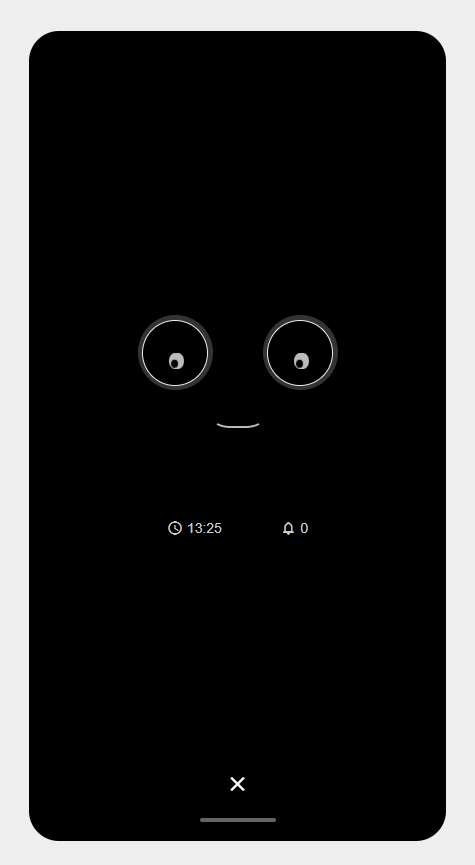
    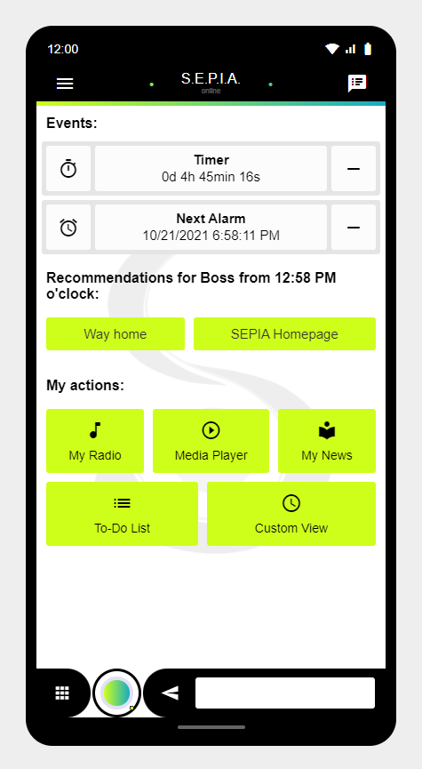
    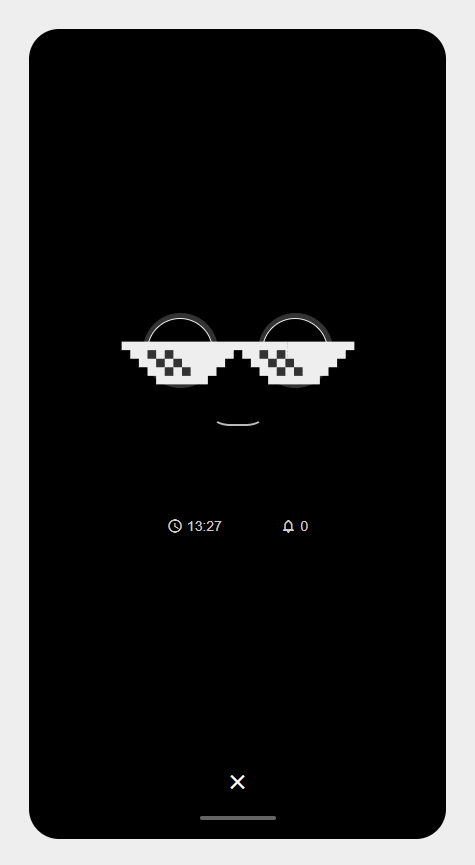
    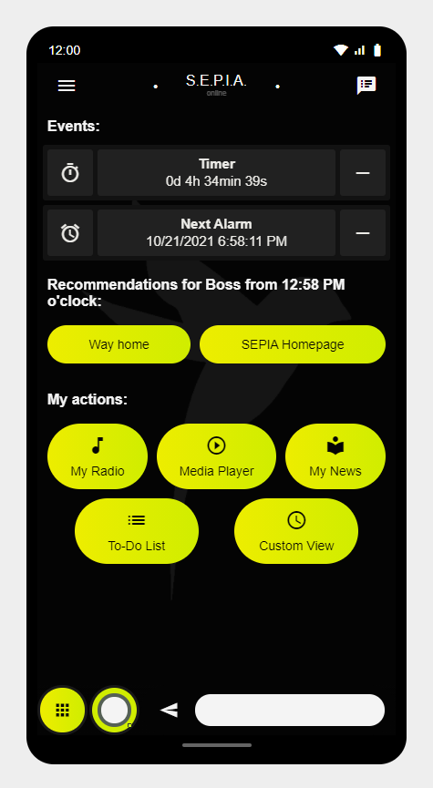
    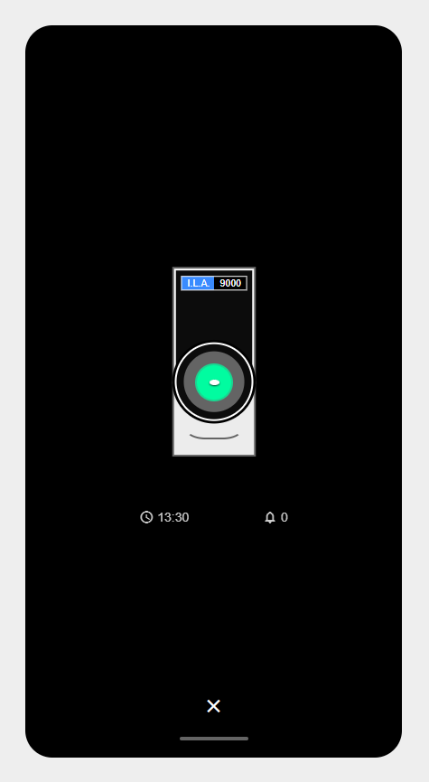
    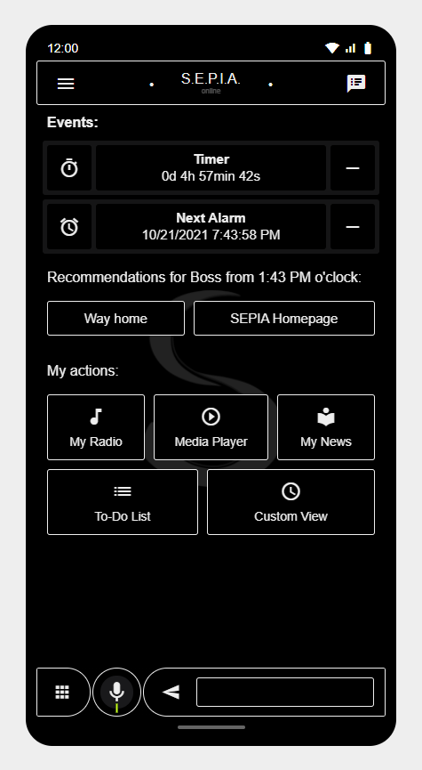
    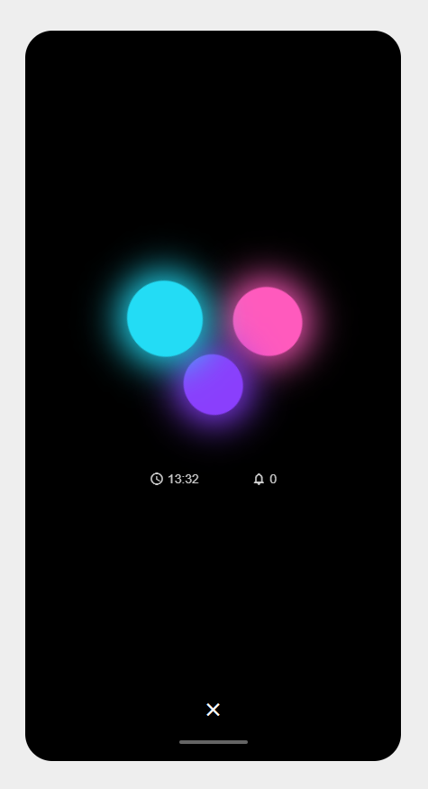
    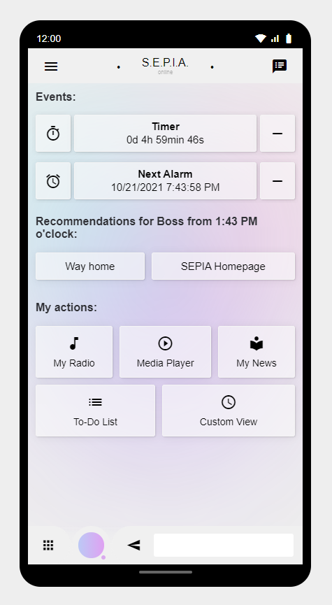
    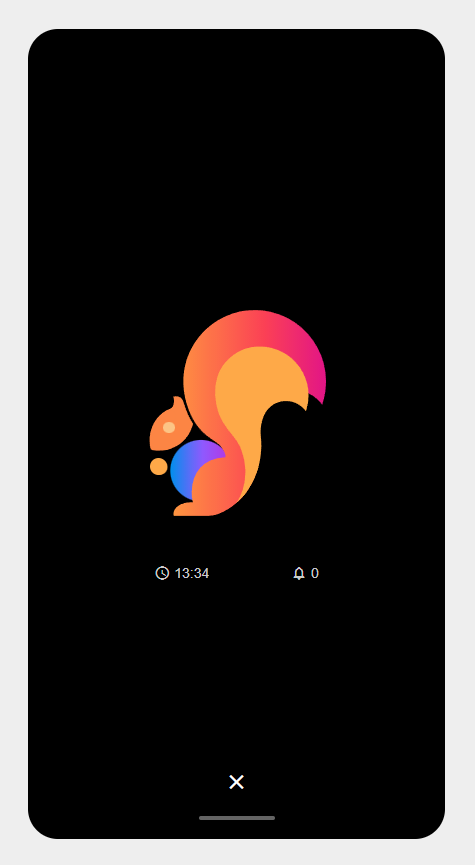
    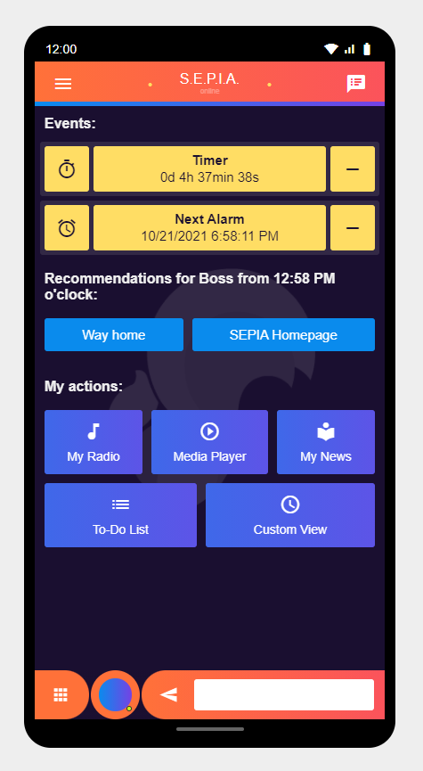
    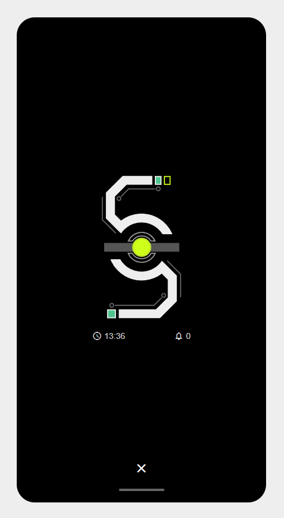
    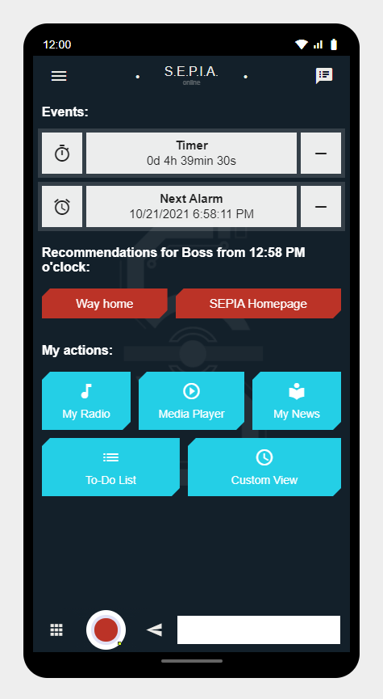
	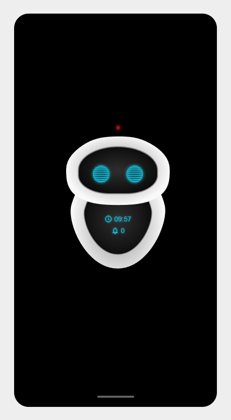
    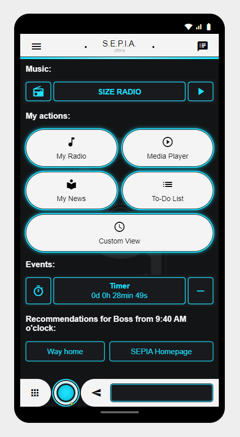
	
	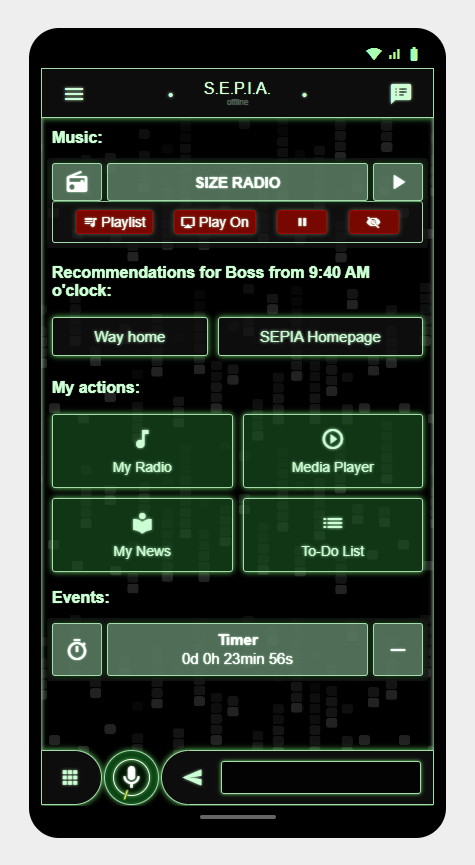

  
Skins in big-screen mode:

    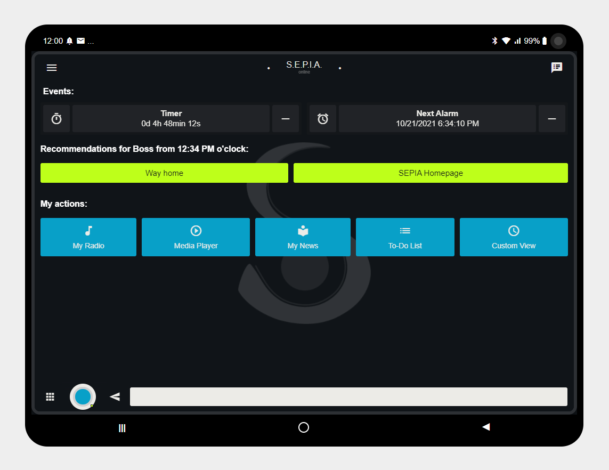
    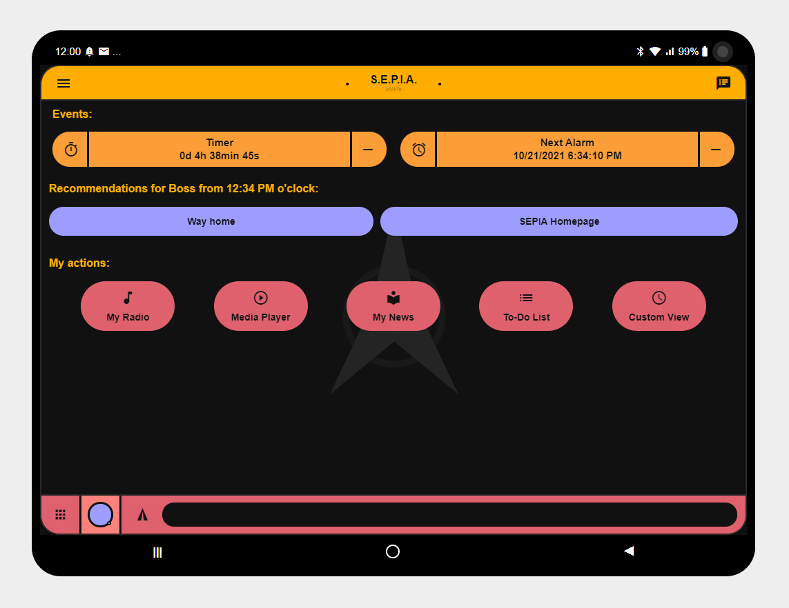
    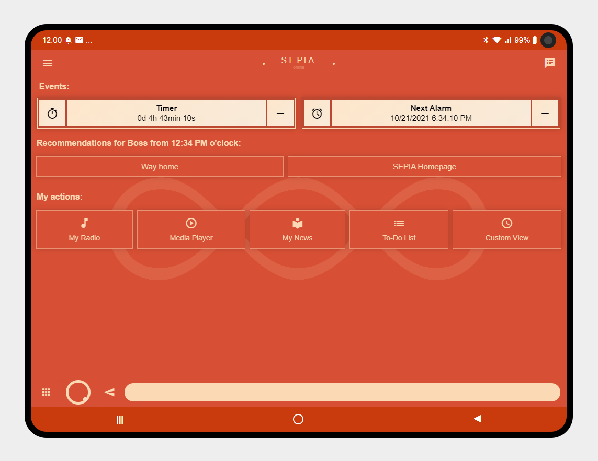
    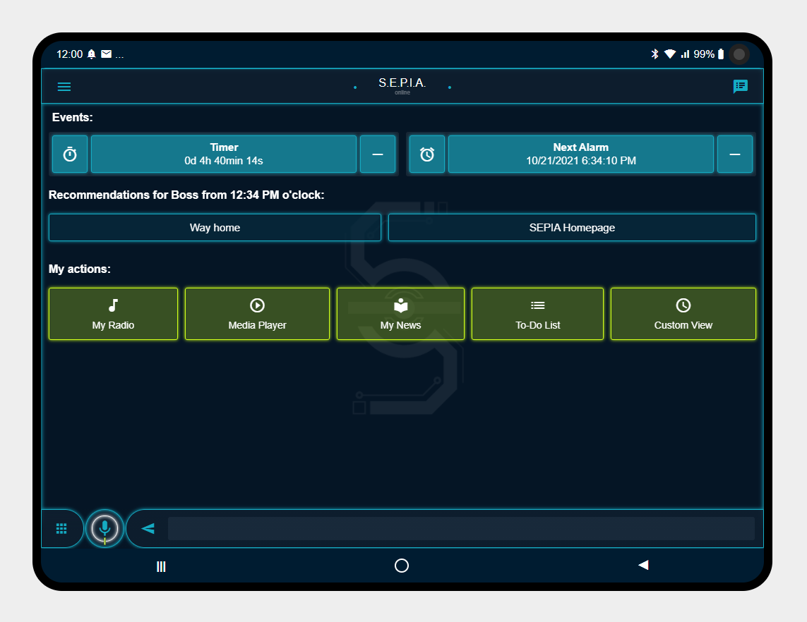

